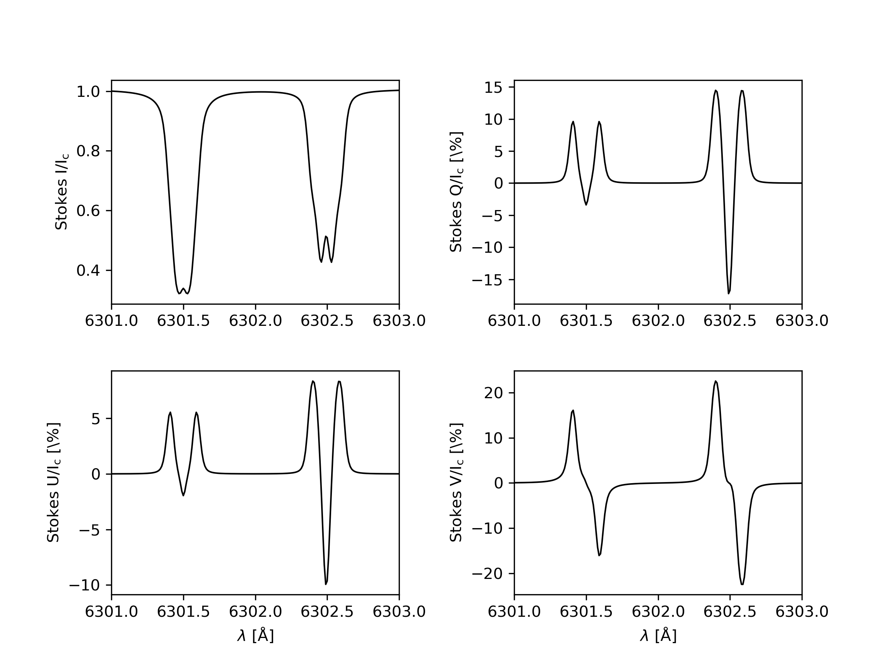

Quickstart
==============

After succesffuly installing **globin** and **pyrh**, lets test the installation and run a few examples for forward modelling and for inversion.

Forward modelling
-----------------

Lets do a quick synthesis of two Fe I lines at 630.15 nm and 630.25 nm using FAL C atmospheric model. Navigate to ``tests/forward_modelling`` directory and open ``run_me.py``.

First, we load the FAL C atmospheric model directly from **globin** and add the magnetic field to it.

.. code-block:: python
    
    import globin
    import os

    # get the FAL-C atmospheric model
    atmosphere = globin.falc
    # we add magnetic field vector to the atmosphere
    atmosphere.add_magnetic_vector(B=1500, gamma=60, chi=15)

By default, **globin** loads in two atmospheric models: FAL C (``globin.falc``) and HSRA atmospheric models (``globin.hsra``). Both of these modells are instances of class ``Atmosphere()``. Here we chose to add the magnetic field vector of strength 1500 G, inclination of 60 degrees and azimuth of 15 degrees.

Now, let us provide information about the incilation angle for which we want to compute the spectrum and also if we would like to normalize the spectrum.

.. code-block:: python

    atmosphere.set_mu(mu=1.00)
    atmosphere.set_spectrum_normalization(norm=True, norm_level=1)

Here we chose to compute it for ``$\mu$=1`` incilation and we normalise the spectrum to the local continuum ``norm_level=1``.

We have to specify the location where we want to have our output files generated (the spectrum in this case). In this example, we will give the location of our script.

.. code-block:: python

    atmosphere.set_cwd(cwd=".")

Then, we have to provide information about what lines and which wavelength region we wish to model.

.. code-block:: python
    
    atmosphere.line_list = "fe6300"
    atmosphere.create_input_files()
    wavelength = globin.utils.compute_wavelength_grid(lmin=6301.0, lmax=6303.0, nwl=201, unit="A")
    atmosphere.set_wavelength_grid(wavelength=wavelength)

Now, we are ready to compute the spectrum.

.. code-block:: python

    spec = globin.inversion.synthesize(atmosphere)

The output spectrum is an instance of ``Spectrum()`` class and we can use **globin** methods to plot it efficiently.

.. code-block:: python

    globin.plot_spectra(spec.spec[0,0], spec.wavelength, norm=True, center_wavelength_grid=False)
    globin.show()

The Stokes spectrum should look like this:

